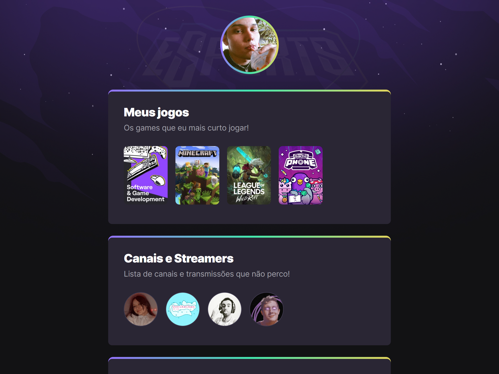

# NLW eSports

> Trilha Explorer

Projeto construído no evento Next Level Week da Rocketseat

[🔗 Clique aqui para acessar](https://pdr-tuche.github.io/NLW-Esports-Explorer/)

assista o video com as funcionalidades:

## 🛠 Tecnologias

- HTML
- CSS
- Git e GitHub

## 📚 O que aprendi:

- Semântica de tags HTML
- Utilizar pseudo-classes em CSS
- Animações em CSS

## 📲 Contato
https://beacons.ai/pdrtuche
